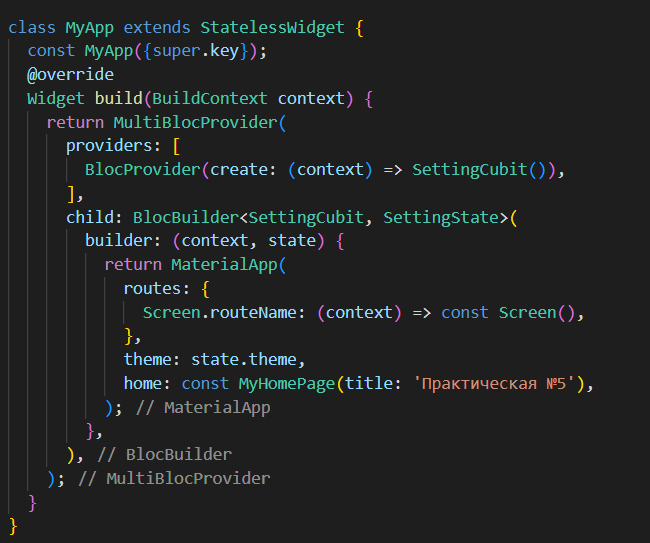
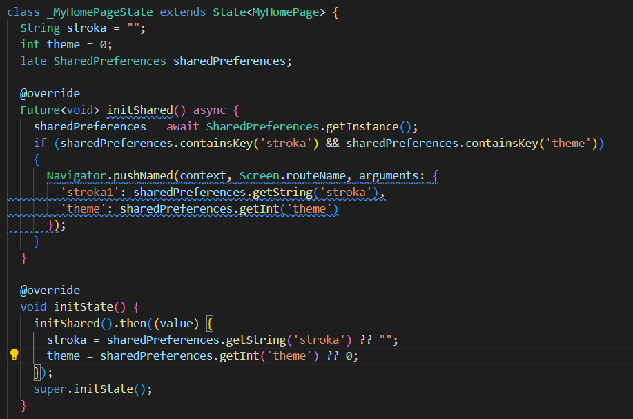
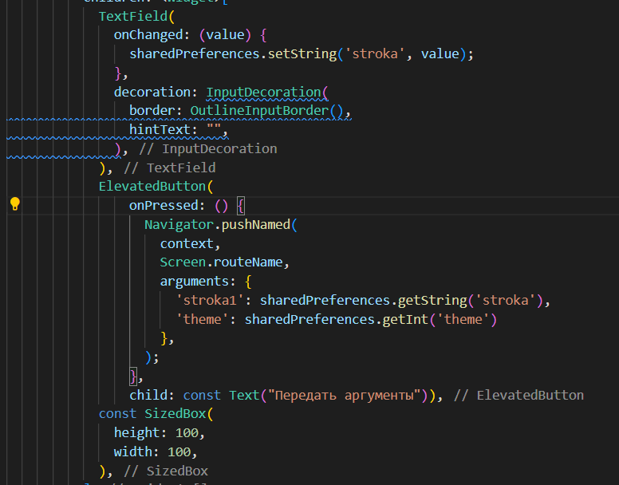
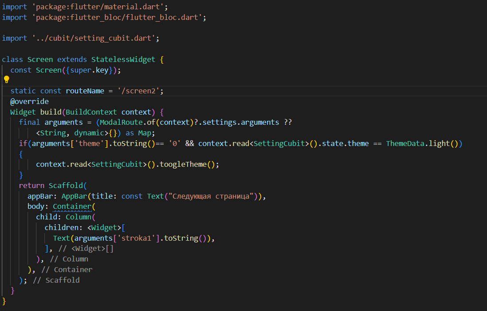
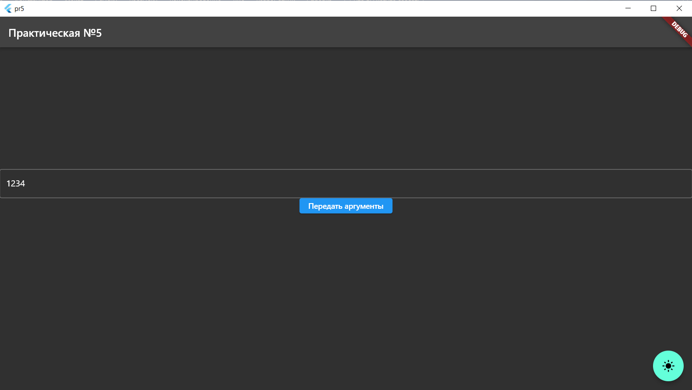
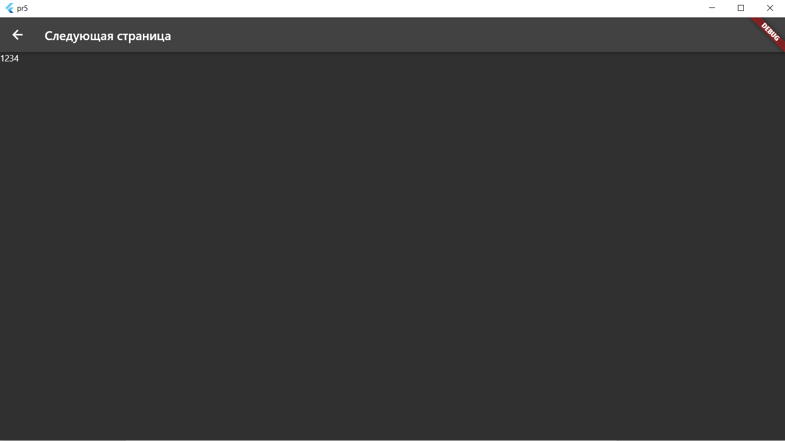

## SharedPrefrences.

Цель работы: научиться работать с сохранениями и переходами между окон приложения. Реализовать: передачу и восстановление данных через параметр arguments и сохранение данных в SharedPrefrences.
Для перехода между окнами необходимо указать возможные переходы при помощи параметра routes, а также передать context cubit отвечающий за тему.

 

  

Для сохранения данных необходимо проинициализировать SharedPrefrences.

  

При помощи функции set (setInt, setString и т.д.) можно записать значение по ключу в память.
Передача нескольких аргументов осуществляется по средствам параметра arguments. Также переданным значениям необходимо присвоить свой ключ, по которому можно будет обращаться к значению на другой странице.

  

 
 Для получения данных нужно проинициализировать переменную (arguments) и уже из нее по ключу получать значения.

  

  

  

Вывод: удалось научиться сохранять данные и передавать значения между окнами.

